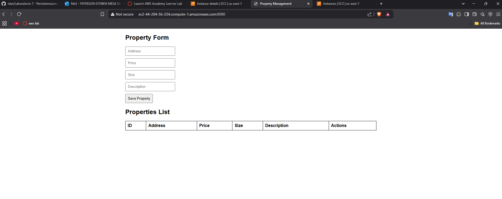
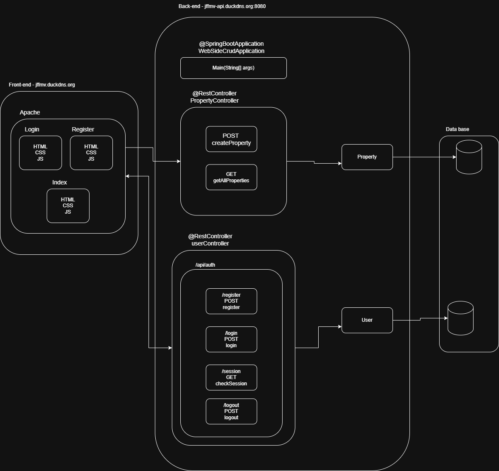

# Link of demostration of work
https://youtu.be/ANg0vcgG4B0
# Virtualization and Introduction to Docker

Refers to breaking applications into smaller, independent modules while using virtualization to run them in isolated environments. Docker simplifies this by using containers, which package applications and their dependencies, ensuring consistency across different environments.
This project use TSL in front-end and back-end and this services are deploy at server differents, front in APACHE and back in SpringBootApplication  

## Getting Started

1. For clone this repository you use this command:
 ```
 git clone https://github.com/JffMv/JPA.git
 ```
2. Compile this project:
 ```
 mvn clena install
 ```
3. Run this project at aws:

 ```
 java -jar web_side_CRUD-0.0.1-SNAPSHOT.jar

 ```
### Prerequisites

Have installed:
maven 3.9.6 - [Install Maven](https://maven.apache.org/download.cgi#Installation)

git 2.44 - [Install Git](https://git-scm.com/book/en/v2/Getting-Started-Installing-Git)


java 21 - [Install Java](https://www.oracle.com/co/java/technologies/downloads/)

## Deployment

Image run this project at instance of AWS.


This project run with docker image for datab ase:

```
jeffer07/lab_5_crud_database
```


### How deploy this application?
#### Local
1. create Dockerfile
2. use for create container ```docker build --tag name_of_container .```
3. use for create image ```docker run -d -p 8080:8080 --name name_of_image name_of_container```
#### Push
5. Tag of container and create other image to load to repository ```docker tag name_container name/repository```
6. Login to docker ```docker login```
7. Do push ```docker push name/repository:latest```

#### Deploy at instance of AWS
8. Create one instance at AWS EC2 and connect
9. Install docker:
```
sudo yum update -y
sudo yum install docker

```
10. Start service of docker:
```
sudo service docker start
```
11. Configure user at group:
```
sudo usermod -a -G docker ec2-user

```
12. Exit and into at the instance
13. Create instance of Dockerhub
```
docker run -d -p 8080:8080 --name name_image_at_aws name/repository
```
14. Open of port at instance of AWS
    
15. Verify whit link in http per port 8080


## Architecture

### HttpServer:
use one server and applications of spring boot 

### Form HTML
Host a simple form and functions javascript. Those functions call API´s

## TSL

### DuckDNS

1. Create a domain with DuckDNS put the IP public of the Amazon EC2 instance.


### Obtaining SSL Certificate and change to format PKCS12 

1. Install Certbot

```
sudo yum install certbot -y
```

2. SSL certificate with Certbot

```
sudo certbot certonly --standalone -d domain
```

3. Export certificate to PKCS12 format.

```
sudo openssl pkcs12 -export \
    -in /etc/letsencrypt/live/"domain"/fullchain.pem \
    -inkey /etc/letsencrypt/live/"domain"/privkey.pem \
    -out keyname.p12 \
    -name "name" \
    -CAfile /etc/letsencrypt/live/"domain"/chain.pem \
    -caname "Let's Encrypt"
```

5. Import at file application.properties

```
server.ssl.key-store=classpath:"keyname".p12
server.ssl.key-store-password="password"
server.ssl.key-store-type=PKCS12
server.ssl.key-alias="name"
server.ssl.enabled=true
```

## Intallation of APACHE

- **Apache Server:**

1. Install apache

```
sudo yum install httpd
```

2. Start apache
```
sudo systemctl start httpd
```

3. Enable apache to start on boot

```
sudo systemctl enable httpd
```

## Test
if you want run of test use this command:
```
mvn test
```
Test of server and API´s work:


## How it see


## Built With!

* [Java](https://www.java.com/es/) - The language used
* [Maven](https://maven.apache.org/) - Dependency Management
* [React](https://reactjs.org/) - Frontend framework
* [Git](http://git-scm.com/) - Version Control System


## Authors

* **Yeferson Mesa**

## License

This project is licensed under the MIT License - see the [LICENCE.md](LICENCE) file for details


